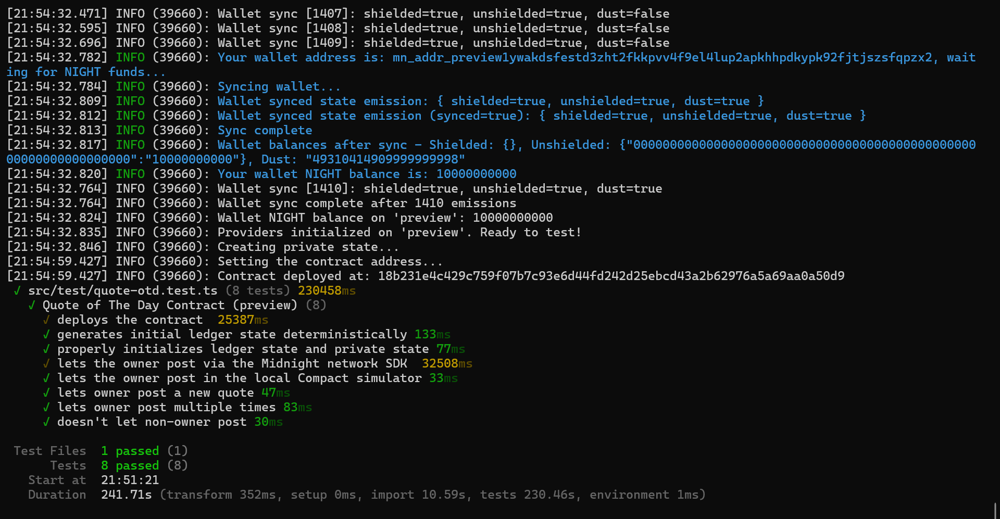

# Quote of the Day

[](https://midnight.network/)
[](https://github.com/oluwatobiss/quote-otd/actions/workflows/ci.yaml)

A Midnight smart contract that lets the owner post a quote for the day which anyone can view.

## Live Demo

https://quote-otd.netlify.app

## Contract Address

| Network | Address                                                          |
| ------- | ---------------------------------------------------------------- |
| Preview | 18b231e4c429c759f07b7c93e6d44fd242d25ebcd43a2b62976a5a69aa0a50d9 |

## What This Does

This project is a smart contract on the Midnight Network that lets the owner post a quote for each day publicly. Only the owner has the authorization to post or update the quote, while anyone can read the currently published quote.

## Privacy Model

This contract uses Midnight's Zero-Knowledge (ZK) capabilities to ensure security and privacy:

- **What is PUBLIC (on-chain, visible to anyone)**:
  - The `quoteOfTheDay`: The actual text payload.
  - The `owner`: The hashed public key of the contract owner.
- **What is PRIVATE (private witness, never on-chain)**:
  - The `creatorIdentity`: The private key of the owner.
- **What the user PROVES without revealing**:
  - The user proves they possess the secret key (`creatorIdentity`) that corresponds to the public key stored on-chain. This authorization happens purely through a Zero-Knowledge proof, guaranteeing security without ever exposing the private key to the network or block explorers. This prove determines the contract's owner and ensures that only the owner can post or update the quote.

## Tech Stack

- **Smart Contract**: Compact language
- **Runtime & Tests**: TypeScript, Node.js, Vitest, Docker
- **SDKs**: Midnight network

## Prerequisites

To run this project locally, you will need:

- **Node.js**: version `24.11.1` or higher.
- **Docker & Docker Compose**: Required for running the local Midnight node environment and proof server.

## Setup

1. **Clone the repository:**

   ```bash
   git clone https://github.com/oluwatobiss/quote-otd.git
   cd quote-otd
   ```

2. **Install dependencies:**

   ```bash
   npm install
   ```

3. **Compile the Compact contract:**

   ```bash
   npm run compile
   ```

## Run Tests

The test suite includes both local simulator tests and network integration tests.

### Testing Locally

1. **Start the local Midnight environment:**

   ```bash
   npm run env:up
   ```

2. **Run the local simulator and local node tests:**

   ```bash
   npm run test:local
   ```

   _(Alternatively, you can use `npm run validate` to start the environment, run tests, and tear it down automatically)_

3. **Stop the local environment:**

   ```bash
   npm run env:down
   ```

### Testing on the Preview Network

To test your smart contract against the live Preview network:

1. **Setup Environment Variables:**

   Copy the `.env.preview.example` file to `.env.preview`:

   ```bash
   cp .env.preview.example .env.preview
   ```

2. **Configure your Wallet:**

   Open `.env.preview` and add your wallet's `MIDNIGHT_PREVIEW_MNEMONIC` or `MIDNIGHT_PREVIEW_SEED`.

   > **Note:** The wallet must be funded with testnet NIGHT tokens from the [Preview Faucet](https://midnight-tmnight-preview.nethermind.dev/) and have DUST delegated.

3. **Run the Preview tests:**

   ```bash
   npm run test:preview
   ```

   _This command will seamlessly deploy the contract to the Preview network and execute the test suite using live on-chain data._

### Testing on the Preprod Network

To test your smart contract against the live Preprod network:

1. **Setup Environment Variables:**

   Copy the `.env.preprod.example` file to `.env.preprod`:

   ```bash
   cp .env.preprod.example .env.preprod
   ```

2. **Configure your Wallet:**

   Open `.env.preprod` and add your wallet's `MIDNIGHT_PREPROD_MNEMONIC` or `MIDNIGHT_PREPROD_SEED`.

   > **Note:** The wallet must be funded with testnet NIGHT tokens from the [Preprod Faucet](https://midnight-tmnight-preprod.nethermind.dev/) and have DUST delegated.

3. **Run the Preprod tests:**

   ```bash
   npm run test:preprod
   ```

   _This command will seamlessly deploy the contract to the Preprod network and execute the test suite using live on-chain data._

## Initial Idea

A privacy-preserving certification verifier for Midnight Academy graduates.

## Screenshots

### Compiled Contract Output


### Deployment and Contract Address



## Demo Video

Pending. 1AM Preview Network unstable while publishing a post. (`Failed Proof Server response: url="https://api-preview.1am.xyz/check", code="500"`)
