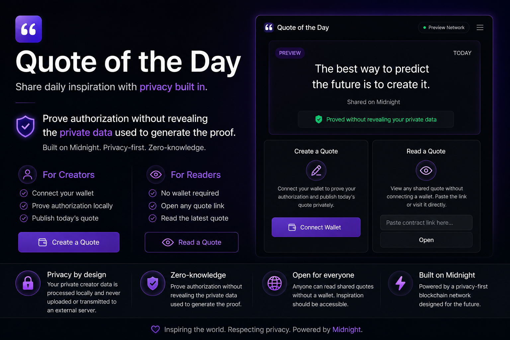
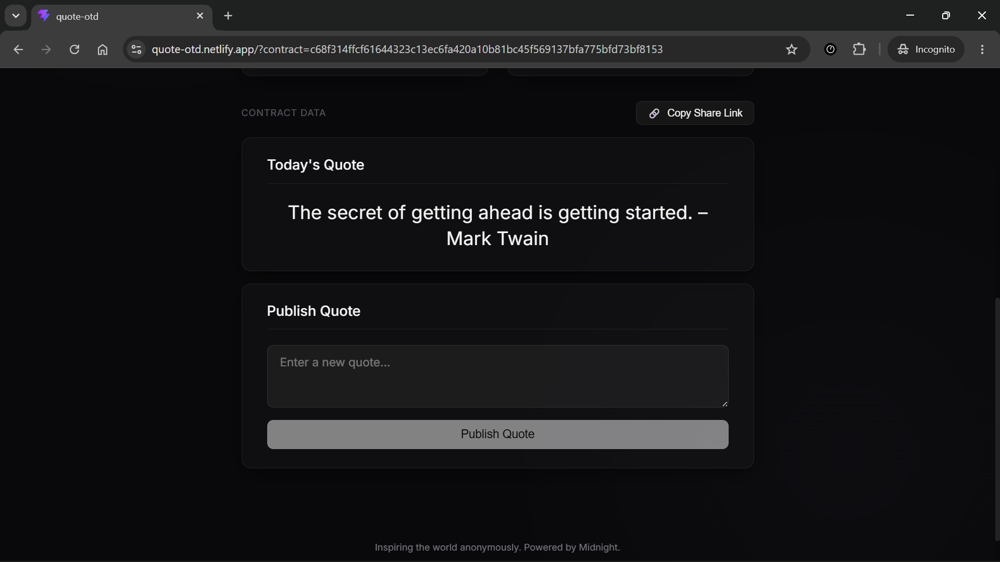
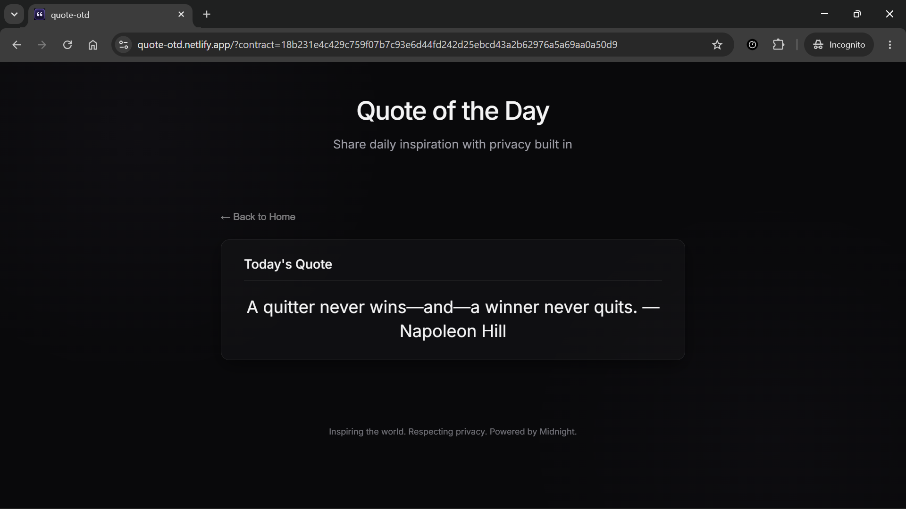
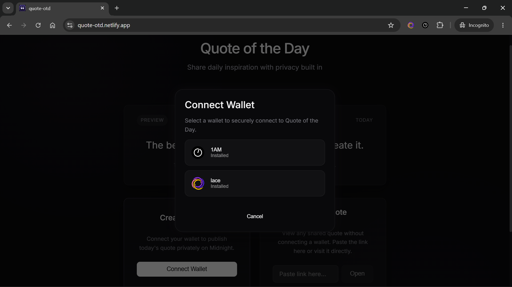
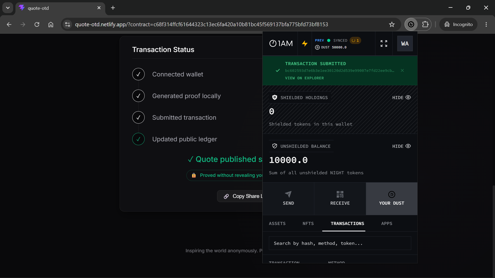
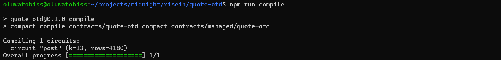

# Quote of the Day

> This project is built on the Midnight Network.

<div>

[](https://midnight.network/)
[](https://github.com/oluwatobiss/quote-otd/actions/workflows/ci.yaml)

</div>

A privacy-first publishing dApp that lets quote publishers prove their authorization without exposing the private data used to generate the proof.

Quote of the Day allows a creator to publish one quote for each day while proving their authorization to update the contract without revealing their private creator identity. Anyone can read the published quote without connecting a wallet.



## Live Demo

- [Try Quote of the Day](https://quote-otd.netlify.app)
- [Watch the DApp's Demo on YouTube](https://youtu.be/sluZUxhLNFk)

## Contract

| Network | Contract Address                                                   |
| ------- | ------------------------------------------------------------------ |
| Preprod | `69b75171dc7a9f7593bd85044a420d942483743e4254135e938c3eb2b22f0b3a` |

The application currently uses the Midnight Preprod network.

## How It Works

Quote of the Day has two primary experiences: **Creator** and **Reader**.

### For Creators

A creator can:

1. Connect a supported Midnight wallet.
2. Provide the creator identity file associated with the deployed contract.
3. Enter a quote.
4. Generate the authorization proof locally.
5. Submit the transaction through their connected wallet.
6. Publish or update the quote on the Midnight network.

The creator's private identity is used locally to generate the zero-knowledge proof. It is never displayed in the application or sent to the contract as plaintext.

> **Proved without revealing your input.**

### For Readers

Readers do not need a wallet to view a quote.

They can:

1. Open the Quote of the Day application.
2. Enter or follow a smart contract URL.
3. View the quote currently published by that contract.

The reader experience is intentionally wallet-free because reading a publicly published quote does not require authorization.

## Privacy Model

Quote of the Day demonstrates one of Midnight's core ideas: **private information can be used to prove authorization without exposing that information on-chain**.

The application separates information into three categories.

### 1. Public Information

The following information is intentionally public:

- The published quote.
- The contract address.
- The public owner information required by the contract.
- The resulting transaction and other publicly observable blockchain data.

The quote itself is public by design. Privacy is used to protect the creator's authorization credential, not to hide the published quote.

### 2. Private Information

The creator's private identity is kept off-chain:

- The creator identity/private key is not stored on the blockchain.
- It is not displayed in the UI.
- It is not sent to a backend.
- It is not placed in a public URL.
- It is not persisted in browser storage.
- It exists only in memory while it is needed to generate the proof.

The application does not use a backend relayer or hidden server-side wallet to publish quotes.

### 3. Zero-Knowledge Proof

When a creator publishes a quote, the application uses the creator's private identity locally to produce the required proof.

The proof demonstrates that the creator possesses the private credential corresponding to the public identity associated with the contract.

The network can verify the proof and enforce the contract's authorization rules without receiving the private credential itself.

This is the key privacy property demonstrated by the project:

> **The creator can prove authorization without revealing the secret used to establish that authorization.**

### Important distinction

Quote of the Day does **not** make the quote private.

The quote is deliberately published as public application data.

The privacy guarantee concerns the **creator's authorization credential**.

Therefore:

**Public quote + private authorization + zero-knowledge proof**

is the fundamental privacy model of this application.

Midnight's architecture supports local ZK proof generation so private inputs can be used by the client without exposing those inputs to the blockchain.

## Privacy Claim

A useful way to understand the privacy model is to compare what an observer can and cannot learn from the blockchain.

| An on-chain observer can see                      | An on-chain observer cannot see              |
| ------------------------------------------------- | -------------------------------------------- |
| Contract address                                  | Creator's private document                   |
| Published quote                                   | The creator's private identity               |
| Public owner information and Transactions         | The secret itself                            |
| Proof/transaction data necessary for verification | The private input used to generate the proof |

## Architecture

Quote of the Day uses a deliberately simple architecture:

```text
                    ┌─────────────────────────┐
                    │       Web Browser       │
                    │                         │
                    │      React Frontend     │
                    └────────────┬────────────┘
                                 │
               ┌─────────────────┴─────────────────┐
               │                                   │
               ▼                                   ▼
       ┌─────────────────┐                 ┌─────────────────┐
       │     Reader      │                 │     Creator     │
       │                 │                 │                 │
       │ Read public     │                 │ Connect wallet  │
       │ contract data   │                 │ Load identity   │
       └────────┬────────┘                 │ Generate proof  │
                │                          │ Submit tx       │
                │                          └────────┬────────┘
                │                                   │
                └─────────────────┬─────────────────┘
                                  ▼
                       ┌─────────────────────┐
                       │   Midnight Network  │
                       │                     │
                       │  Quote of the Day   │
                       │   Smart Contract    │
                       └─────────────────────┘
```

There is **no application backend** between the browser and the Midnight network.

The frontend is a static application that can be deployed to services such as Netlify.

### Why No Backend?

Removing the backend is intentional.

A server-side architecture could introduce an unnecessary location where private creator credentials might be handled.

Instead:

- The creator identity is processed locally.
- Proof generation happens locally.
- The user's connected wallet handles the transaction authorization/fees.
- The Midnight network verifies the resulting proof and executes the contract.

This keeps the application's privacy model aligned with Midnight's client-side proving architecture.

## Creator Identity

The creator identity is associated with the deployed contract.

The deployment process produces a `.quoteotd` identity file containing the information required by the application to identify the corresponding contract.

The application reads this file **in memory** when the creator needs to publish a quote.

The file itself is not uploaded to a server.

The creator's private identity is not exposed through the UI and is not persisted in browser storage.

## Wallet Integration

Creators use the official Midnight wallet connection flow through the Midnight DApp Connector API.

The wallet is used for the blockchain interaction required to publish the quote.

The application does not:

- Generate a hidden server wallet.
- Store a relayer wallet.
- Ask the application backend to submit transactions.
- Automatically select a wallet without the creator's choice.

The creator explicitly connects the wallet they want to use.

Midnight's browser-wallet architecture is designed to allow DApps to interact with the network through supported wallet software.

## Reader Experience

Reading is intentionally simpler than publishing.

A reader only needs the smart contract URL.

No:

- Wallet connection
- Creator identity
- Private key
- Transaction
- Account
- Login

is required to read a publicly published quote.

The Reader view is designed to keep the quote itself as the visual focus rather than presenting blockchain terminology to the reader.

## Smart Contract

The smart contract is written in **Compact**, Midnight's smart-contract language.

Conceptually, the contract maintains:

```text
owner
quoteOfTheDay
```

The owner is established through the contract's public identity information.

Publishing or updating a quote requires successful authorization through the creator's private identity and the corresponding zero-knowledge proof.

Readers can access the currently published quote without possessing the creator's private credential.

## Tech Stack

### Frontend

- React
- TypeScript
- Vite
- CSS

### Smart Contract

- Compact
- Midnight Compact Runtime
- Midnight SDKs

### Blockchain

- Midnight Network
- Preprod Network

### Wallet

- Midnight DApp Connector API
- Compatible Midnight wallet

### Development & Testing

- Node.js
- TypeScript
- Vitest
- Docker
- Docker Compose

### Deployment

- Netlify

## Project Structure

The project is broadly organized around the following areas:

```text
.
├── .github/
│   └── workflows/
│
├── README.md
├── compose.yml
│
├── contracts/
│   ├── index.ts
│   ├── managed/
│   └── quote-otd.compact
│
├── eslint.config.js
├── index.html
├── netlify.toml
├── package.json
│
├── providers/
│   ├── buildBrowserProviders.ts
│   ├── buildNodeProviders.ts
│   ├── inMemoryPrivateStateProvider.ts
│   └── walletProviders.ts
│
├── scripts/
│   ├── deploy.ts
│   └── deployment.ts
│
├── app/
│   ├── App.css
│   ├── App.tsx
│   ├── assets/
│   ├── components/
│   ├── index.css
│   ├── joinQuoteContract.ts
│   ├── main.tsx
│   ├── quoteOTDClient.ts
│   └── test/
│
├── tsconfig.app.json
├── tsconfig.json
├── tsconfig.node.json
│
├── utils/
│   ├── config.ts
│   ├── copyShareLink.ts
│   ├── crypto.ts
│   ├── quote.types.ts
│   ├── resolveSecret.ts
│   ├── wallet.ts
│   └── witnesses.ts
│
├── vite.config.ts
└── vitest.config.ts
```

The generated `contracts/managed/` directory contains artifacts produced by the Compact compiler and is required by the application's build/deployment setup.

## Prerequisites

To develop and test the project locally, install:

- **Node.js:** `24.11.1` or higher
- **Docker**
- **Docker Compose**
- A supported Midnight wallet, like 1AM, for creator/network testing

## Local Development

### 1. Clone the Repository

```bash
git clone https://github.com/oluwatobiss/quote-otd.git
cd quote-otd
```

### 2. Install Dependencies

```bash
npm install
```

### 3. Compile the Compact Contract

```bash
npm run compile
```

This generates the JavaScript, cryptographic, and circuit artifacts required by the application and tests.

## Running the Application

Start the development server using the project's development script:

```bash
npm run dev
```

The application can then be opened in the browser at the local development URL reported by Vite.

## Testing

The project contains tests for both the local development environment and live Midnight networks.

### Local Tests

Start the local Midnight environment:

```bash
npm run env:up
```

Run the local tests:

```bash
npm run test:local
```

When finished:

```bash
npm run env:down
```

### Validate Everything Automatically

The project also provides:

```bash
npm run validate
```

This runs the local validation workflow, including starting the required environment, executing the tests, and shutting the environment down afterward.

## Preview Network Testing

Preview-network testing uses a wallet configured through environment variables.

### 1. Create the Environment File

```bash
cp .env.preview.example .env.preview
```

### 2. Configure the Wallet

Add either:

```text
MIDNIGHT_PREVIEW_MNEMONIC
```

or:

```text
MIDNIGHT_PREVIEW_SEED
```

to `.env.preview`.

The wallet must have the required Preview testnet funds and DUST delegation.

### 3. Run the Tests

```bash
npm run test:preview
```

The Preview test workflow deploys the contract and runs the integration tests against the live network.

> **Security:** Never commit `.env.preview`, `.env.preprod`, mnemonics, seeds, private keys, or other wallet credentials to Git.

## Preprod Network Testing

### 1. Create the Environment File

```bash
cp .env.preprod.example .env.preprod
```

### 2. Configure the Wallet

Add either:

```text
MIDNIGHT_PREPROD_MNEMONIC
```

or:

```text
MIDNIGHT_PREPROD_SEED
```

to `.env.preprod`.

The wallet must have the required Preprod testnet funds and DUST delegation.

### 3. Run the Tests

```bash
npm run test:preprod
```

The Preprod test workflow deploys the contract and executes the integration tests against the live network.

## CI/CD

The project uses GitHub Actions to automatically validate changes made to the repository.

The CI pipeline is designed to catch problems before changes are merged or deployed.

The pipeline performs the project's required quality checks, including:

1. Installing dependencies.
2. Running TypeScript type checking.
3. Running linting.
4. Building the application.
5. Running the project's validation/test workflow where applicable.
6. Running security/scanning checks.
7. Building the production frontend used for deployment.

This means a pull request is checked automatically rather than relying solely on manual local testing. The CI workflow helps detect:

- TypeScript errors
- Lint errors
- Failed builds
- Broken contract/application integration
- Dependency or configuration problems
- Security issues detected by the scanning workflow

Secrets are scoped as narrowly as possible within CI workflows. In particular, GitHub credentials should not be unnecessarily exposed at the workflow level.

## Deployment

The frontend is designed to run as a static web application and deployed through Netlify.

The production deployment does not require a private application backend or a server-side relayer wallet.

The deployment architecture is:

```text
GitHub
   │
   │ push / merge
   ▼
Netlify
   │
   │ static frontend
   ▼
Browser
   │
   ├── Reader → Midnight Network
   │
   └── Creator → Wallet → Midnight Network
```

The Compact contract is deployed separately to the Midnight network.

The frontend then uses the resulting contract information to interact with that deployment.

## Security Principles

Quote of the Day follows several security principles.

### Private credentials stay local

Creator private information is never intentionally sent to an application server.

### No hidden relayer

The application does not use a backend-controlled wallet to submit creator transactions.

### No persistent private state

Private creator state is kept in memory rather than being persisted in browser storage.

### Public data is treated as public

The published quote and blockchain transaction information are not presented as private information.

### Secrets never belong in Git

Environment files containing wallet credentials must remain local and must never be committed.

## What This Project Demonstrates

Quote of the Day is intentionally small, but it demonstrates several important Midnight concepts:

- Smart contracts written in Compact.
- Public and private data in a blockchain application.
- Zero-knowledge authorization.
- Local proof generation.
- Private witnesses.
- Wallet-based transaction submission.
- Static DApp architecture.
- Wallet-free public reading.
- Privacy-preserving creator authorization.
- Deployment and testing against a live Midnight network.

The goal is not simply to publish quotes. It is to allow quote publishers to prove their authorization to publish quotes through the dApp without exposing the private data used to generate the proof.

## Product Proposal

See PROPOSAL.md

## Screenshots

### Creator View



### Reader View



### Wallet Connection



### Published Quote



### Compiled Contract Output



### Deployment and Contract Address


## Security and Privacy Considerations

Quote of the Day is designed so that creator private data used for authorization is processed locally and is never uploaded to the application or transmitted to an external server. In particular:

- The quote itself is public. Once published, anyone can read it and observe the corresponding on-chain data.
- Blockchain transactions remain publicly observable according to the network's data model.
- The application cannot make information private after a creator intentionally publishes it.
- Losing access to the creator's private identity can prevent the creator from authorizing future updates.
- Network availability and wallet functionality depend on the Midnight environment being used.

## Acknowledgements

Built with the [Midnight Network](https://midnight.network) and its privacy-preserving smart-contract technology.

Quote of the Day uses Compact and Midnight's privacy-preserving proving architecture to allow publishers to verify their authorization without exposing the underlying private data used to generate the proof.
